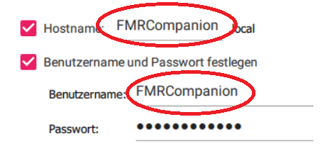
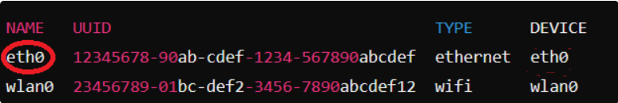

<a id="readme-top"></a>
<!-- PROJECT SHIELDS -->
<!--
*** I'm using markdown "reference style" links for readability.
*** Reference links are enclosed in brackets [ ] instead of parentheses ( ).
*** See the bottom of this document for the declaration of the reference variables
*** for contributors-url, forks-url, etc. This is an optional, concise syntax you may use.
*** https://www.markdownguide.org/basic-syntax/#reference-style-links
-->


<!-- PROJECT LOGO -->
<br />
<div align="center">
  <a href="https://github.com/github_username/repo_name">
    
  </a>

<h3 align="center">FMRCompanion</h3>
</div>


<!-- TABLE OF CONTENTS -->
<details>
  <summary>Table of Contents</summary>
  <ol>
    <li><a href="#about-the-project">About The Project</a>
    <li>
      <a href="#getting-started">Getting Started</a>
      <ul>
        <li><a href="#Setting up the RasPi">Setting up the RasPi</a></li>
        <li><a href="#Setup in QGroundcontrol">Setup in QGroundcontrol</a></li>
      </ul>
    </li>
    <li><a href="#Code Overview">Code Overview</a></li>
    <li><a href="#Required python packages">Required python packages</a></li>
    <li><a href="#license">License</a></li>
    <li><a href="#contact">Contact</a></li>
  </ol>
</details>


<!-- ABOUT THE PROJECT -->
## About The Project

This project contains all required code for the inhouse FMRCompanion computer to assist the main PX4 flightcontroller. All code is written in python and ready to be implemented on a RasPi 5 according to the getting started section. 

<p align="right">(<a href="#readme-top">back to top</a>)</p>

<!-- GETTING STARTED -->
## Getting Started

This section gives a quick rundown on how to setup a brand new RasPi download the repository and install all required software. The second part of the section explains the setup process required on the flightcontroller using qgroundcontrol to enable the mavlink communication between flightcontroller and Pi over ethernet using mavlink

### Setting up the RasPi

#### Flashing RASPBERRY PI OS
Download and install RasPi imager and setup according to this [guide](https://www.raspberrypi.com/documentation/computers/getting-started.html). Connect SD card to PC and select the model according to your RasPi version (only tested with RasPi 5 although others should work as well) and RASPBERRY PI OS (64-BIT) as the opperating system. During setup ensure that both host name and user name highlighted in the image below are set to FMRCompanion, otherwise paths defind in the code wont initialise correctly. Setup Wifi according to your WiFi credentials (eduroam does not work).

<br />
<div align="center">
  <a href="https://github.com/Mathis-Werner/FMRCompanion">
    
  </a>
</div>

#### Installing the repository and dependencys on the RasPi

Start the flashed RasPi and open a terminal either using SSH which has to be [setup](https://randomnerdtutorials.com/raspberry-pi-remote-ssh-vs-code/) in VSCode and on the Pi accordingly, or by connecting a monitor and keyboard to the RasPi. (Hotkey to open terminal is Ctrl+Alt+T) The rest of the following setup is done in the opened terminal on the RasPi.

1. **Installing git**
  ```sh
  cd
  sudo apt update
  sudo apt install git -y
  git config --global user.name "FMRCompanion"
  git config --global user.email "none"
   ```

2. **Create folder and clone repository**
  ```sh
  cd
  git init FMRCompanion
  cd FMRCompanion
  git remote add origin https://github.com/Mathis-Werner/FMRCompanion.git
  git pull origin main
  git checkout main
  git branch -D master
   ```
Update FMR-pymavlink submodule
  ```sh
  git submodule update --init --recursive
  ```

3. **Install miniconda**
  ```sh
  cd Downloads # Navigate to downloads folder
  wget https://repo.anaconda.com/miniconda/Miniconda3-latest-Linux-aarch64.sh
  bash Miniconda3-latest-Linux-aarch64.sh  # Install
  ```
Enter --> Ctrl+X to open and accept licence, enter again to accept default folder. **After installation type yes to enable conda by default!** 

4. **Create new conda enviroment**
  ```sh
  cd
  cd FMRCompanion
  conda create --name FMRCompanion python=3.9
  conda activate FMRCompanion

  # At this point install all required packages defined in the section below for example:
  # pip install smbus2

  conda config --set auto_activate_base false 
  echo "conda activate FMRCompanion" >> ~/.bashrc # Set FMRCompanion as default enviroment
  source ~/.bashrc
  ```

5. **Enable I2C** 
  ```sh
  sudo raspi-config
  ```
  Interface Options --> I2C --> Enable.

6. **Install I2C tools**
  ```sh
  sudo apt install -y i2c-tools
  ```

7. **Configure ethernet for mavlink communication**<br />
  Get available networks
  ```sh
  cd
  nmcli con show
  ```
  The string in the collum Name, highlighted in the image below corresponding to the TYPE ethernet can variy and is refered to as NetworkName in the following code.
  <br />
  <div align="center">
    <a href="https://github.com/Mathis-Werner/FMRCompanion">
      
    </a>
  </div>

  Set static ip in the network:
  
  ```sh
  nmcli con modify "NetworkName" ipv4.addresses 192.168.0.1/24 
  nmcli con modify "NetworkName" ipv4.gateway 192.168.0.254 
  nmcli con modify "NetworkName" ipv4.dns 8.8.8.8 
  nmcli con modify "NetworkName" ipv4.method manual
  ```
  Restart NetworkManager:
  ```sh
  nmcli con down "NetworkName" && nmcli con up "NetworkName"
  ```
  Ensure NetworkManager starts on boot:
  ```
  sudo systemctl enable NetworkManager
  sudo systemctl restart NetworkManager
  ```

8. **Enable the autostart of the main.py script on bootup**<br />
  Create launcher.sh in home directory which will be used to define everything happening on boot:
  ```sh
  cd
  nano launcher.sh
  ```
  Open launcher.sh using nano:
  ```sh
  sudo nano launcher.sh
  ```
  In the file add the following code:
  ```
  #!/bin/sh
  # launcher.sh
  # Script to define execution on boot

  cd 
  cd ~/FMRCompanion
  sudo ~/FMRCompanion/miniconda3/envs/FMRCompanion/pin/python main.py #Runs main.py using the FMRCompanion conda enviroment
  cd
  ```
  Ctrl+X --> Y --> Enter to save

### Setup in QGroundcontrol

1. **Flash the flightcontroller with the desired firmware**
2. **Connect the flightcontroller to QGroundcontrol on a PC**
3. **Go to parameters set and update the following parameters**
  * MAV_2_Config = Ethernet (1000) (Declare Mavlink port 2 as Ethernet)
  * MAV_2_Mode = Onboard (Transmit default on board parameter set)
  * MAV_2_REMOTE_PRT = 14540 (Set port for companion computer)
  * MAV_2_UDP_PRT = 14540 (Set port for companion computer)
4. **Setup the ethernet network**<br />
  In QGroundcontrol click on QGroundcontrol symbol --> Analyze Tools --> MAVLink Console and enter:
  ```sh
  echo DEVICE=eth0 > /fs/microsd/net.cfg
  echo BOOTPROTO=static >> /fs/microsd/net.cfg
  echo IPADDR=192.168.0.4 >> /fs/microsd/net.cfg 
  echo NETMASK=255.255.255.0 >>/fs/microsd/net.cfg
  echo ROUTER=192.168.0.254 >>/fs/microsd/net.cfg
  echo DNS=192.168.0.254 >>/fs/microsd/net.cfg
  netman update -i eth0
  ```
Reboot the flightcontroller

<p align="right">(<a href="#readme-top">back to top</a>)</p>


<!-- Code Overview -->
## Code Overview

``` sh
/FMRCompanion
│── main.py  # Main Script
│── /tools   # Add all self developed classes to run with main here
│   │── __init__.py 
│   │── logger.py  # Contains the Logger class used to write csv to USB Stick
│   │── uavtracker.py  # Contains the UAVTracker class used to handle communication with flightcontroller over mavlink
│── /threads   # Contains all functions initialised as threads in the main script (except mavlink handling)
│   │── __init__.py
│   │── sensorReadout.py # Function used in thread to handle all features involving attached sensorReadout
│── /peripherals   # Add all sensors/external hardware here
│   │── __init__.py
│   │── hcla02x5eb.py # Contains the HCLA02X5EB pressure sensor class
│   │── tca9548a.py # Contains the TCA9548A I2C multiplexer class
│── /tests # Folder to included scripts for testing purposes
│── /images # Folder with images to make this doc pretty
```
### Logger Class Overview

#### Description
The logger is used to store all data to a external USB stick. It is designed to be used in a way where all recorded data is first loaded into a buffer using the log_data() function so that all recorded data at a time step can be written to the .csv at the same time labled by the current datetime. The logger will automatically try to detect a USB drive connected to the pi to use for storing the data. If desired the directory can explicitly specified during intialisation by for example:

```python
logger = Logger("/media/FMRCompanion/NameOfYourStick")
```

#### Functions
* create_csv(): Creates a new csv file with the naming convention "Sensor_log{Current Date/Time}" which will then be filled with data by write_data_to_csv()
* log_data(data_lable, value): Loads data into the data_buffer with data_lable used later when writing the data to the file in the header and the value in the row corresponding to the of writing
* write_data_to_csv(): Writes all data stored in the buffer by using log_data() to the csv file automatically creating a new row with the current timestamp and creating new headers when a new data_lable was created using log_data()

#### Example

```python
logger = Logger() # Creates logger object automatically detecting attached drives
logger.create_csv() # Creates a .csv on the drive in which to store all data
data_sensor_a = read_sensor_a() # Read data from sensor
logger.log_data("Sensor_A", data_sensor_a) # Store data in buffer
data_sensor_b = read_sensor_b()
logger.log_data("Sensor_B", data_sensor_b) # Store data in buffer
logger.write_data_to_csv() # Writes all data stored in the buffer into csv
```

### Uavtracker Class Overview

#### Description
The uavtracker class is setup to both initialise a communication with the attached flightcontroller using the mavlink protocoll and handle all data transfer between RasPi and flgihtcontroller. For this the package mavsdk is used which heavly relies on asynchronous programming using the asyncio libary to avoid blocking when handeling network tasks. As such every communication task is initialised as its own async function with the main run() loop establishing a connection to the flightcontroller and gathering all defined coroutines for asynchronous execution.

#### Functions
* run(): Main loop used to establish a connection to the flight controller and starting the asynchronous execution of all coroutines defined in the asyncio.gather() functions
* getPosition(): Asynchronous coroutine to continously request lattitude and longitude data from the flight controller and update the corresponding class attributes
* getLoggingSwitch(): Asynchronous coroutine to continously request arm state and set class attribute logging_enabled to true once the UAV is armed. This logging can be triggered by a switch in arm state
* run_in_thread(): Function to setup a seperate asyncio event loop containing the main run() function to allow execution in a thread on higher levels.

#### Example
With the following example a communication with the flightcontroller can be initialised in a seperate thread with the drone.run_in_thread function continously updating the object attributes based on the values read from the flightcontroller.
```python
drone = UAVTracker() # Create UAVTracker object
updateDroneThread = threading.Thread(target=drone.run_in_thread, daemon=True) # Create thread for UAVTracker object
updateDroneThread.start() # Start thread
```
<p align="right">(<a href="#readme-top">back to top</a>)</p>


<!-- Required python packages -->
## Required python packages

* smbus2
* mavsdk

<p align="right">(<a href="#readme-top">back to top</a>)</p>


<!-- LICENSE -->
## License

Distributed under the project_license. See `LICENSE.txt` for more information.

<p align="right">(<a href="#readme-top">back to top</a>)</p>


<!-- CONTACT -->
## Contact

Mathis Werner - wer.mathis@gmail.com

Project Link: [https://github.com/Mathis-Werner/FMRCompanion](https://github.com/Mathis-Werner/FMRCompanion)

<p align="right">(<a href="#readme-top">back to top</a>)</p>


<!-- MARKDOWN LINKS & IMAGES -->
<!-- https://www.markdownguide.org/basic-syntax/#reference-style-links -->
[contributors-shield]: https://img.shields.io/github/contributors/github_username/repo_name.svg?style=for-the-badge
[contributors-url]: https://github.com/github_username/repo_name/graphs/contributors
[forks-shield]: https://img.shields.io/github/forks/github_username/repo_name.svg?style=for-the-badge
[forks-url]: https://github.com/github_username/repo_name/network/members
[stars-shield]: https://img.shields.io/github/stars/github_username/repo_name.svg?style=for-the-badge
[stars-url]: https://github.com/github_username/repo_name/stargazers
[issues-shield]: https://img.shields.io/github/issues/github_username/repo_name.svg?style=for-the-badge
[issues-url]: https://github.com/github_username/repo_name/issues
[license-shield]: https://img.shields.io/github/license/github_username/repo_name.svg?style=for-the-badge
[license-url]: https://github.com/github_username/repo_name/blob/master/LICENSE.txt
[linkedin-shield]: https://img.shields.io/badge/-LinkedIn-black.svg?style=for-the-badge&logo=linkedin&colorB=555
[linkedin-url]: https://linkedin.com/in/linkedin_username
[product-screenshot]: images/screenshot.png
[Next.js]: https://img.shields.io/badge/next.js-000000?style=for-the-badge&logo=nextdotjs&logoColor=white
[Next-url]: https://nextjs.org/
[React.js]: https://img.shields.io/badge/React-20232A?style=for-the-badge&logo=react&logoColor=61DAFB
[React-url]: https://reactjs.org/
[Vue.js]: https://img.shields.io/badge/Vue.js-35495E?style=for-the-badge&logo=vuedotjs&logoColor=4FC08D
[Vue-url]: https://vuejs.org/
[Angular.io]: https://img.shields.io/badge/Angular-DD0031?style=for-the-badge&logo=angular&logoColor=white
[Angular-url]: https://angular.io/
[Svelte.dev]: https://img.shields.io/badge/Svelte-4A4A55?style=for-the-badge&logo=svelte&logoColor=FF3E00
[Svelte-url]: https://svelte.dev/
[Laravel.com]: https://img.shields.io/badge/Laravel-FF2D20?style=for-the-badge&logo=laravel&logoColor=white
[Laravel-url]: https://laravel.com
[Bootstrap.com]: https://img.shields.io/badge/Bootstrap-563D7C?style=for-the-badge&logo=bootstrap&logoColor=white
[Bootstrap-url]: https://getbootstrap.com
[JQuery.com]: https://img.shields.io/badge/jQuery-0769AD?style=for-the-badge&logo=jquery&logoColor=white
[JQuery-url]: https://jquery.com 
